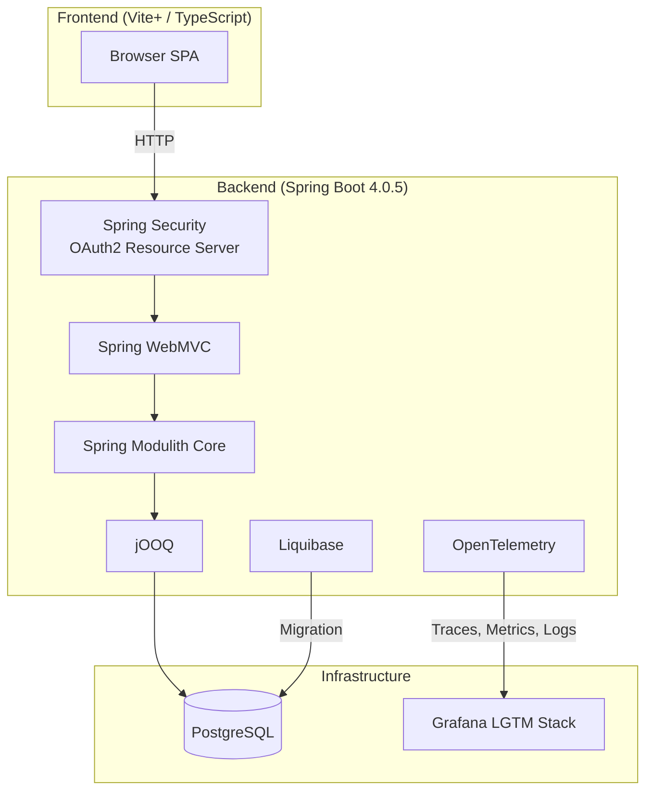
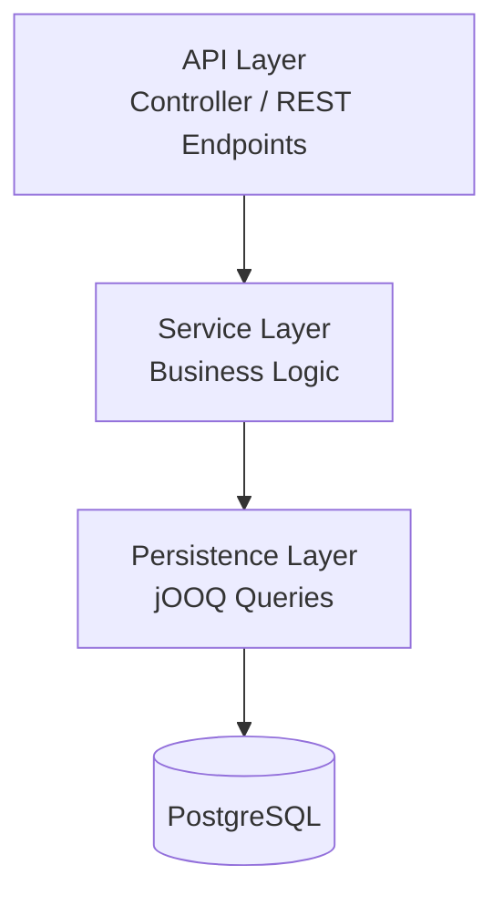
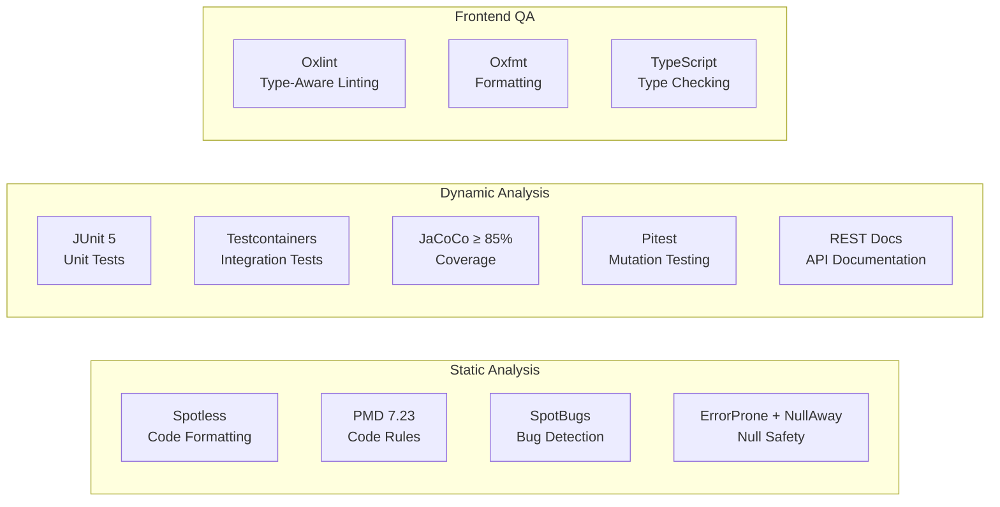

# Architecture

## System Overview

spring-modulith-ai-harness は、Spring Modulith ベースのモジュラーモノリスアーキテクチャを採用したフルスタックアプリケーション。バックエンド（Spring Boot）とフロントエンド（Vite+ TypeScript）の2層構成。

## Architectural Patterns

### Modular Monolith (Spring Modulith)

Spring Modulith によるモジュール境界の強制。パッケージ `com.example.demo` 配下にモジュールを配置し、モジュール間の依存関係を Spring Modulith が検証する。

### Layered Architecture

各モジュール内は以下のレイヤー構成を想定：

### Security Architecture

OAuth2 Resource Server パターンを採用。JWT トークンによるステートレス認証。

### Observability Architecture

OpenTelemetry + Spring Modulith Observability によるトレース・メトリクス・ログの統合。Grafana LGTM（Loki, Grafana, Tempo, Mimir）スタックで可視化。

## Design Decisions

| Decision                     | Rationale                                                    |
| :--------------------------- | :----------------------------------------------------------- |
| Spring Modulith              | モジュール境界の強制と将来のマイクロサービス分割への備え     |
| jOOQ over JPA                | 型安全な SQL クエリと複雑なクエリの表現力                    |
| Liquibase                    | バージョン管理されたデータベースマイグレーション             |
| OAuth2 Resource Server       | ステートレスな API 認証                                      |
| Testcontainers               | 本番同等のインフラでの統合テスト                             |
| JSpecify + NullAway          | コンパイル時の null 安全性保証                               |
| Vite+ (frontend)             | Vite, Oxlint, Oxfmt, Vitest の統合ツールチェーン            |

## Quality Architecture

