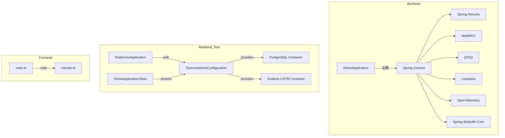
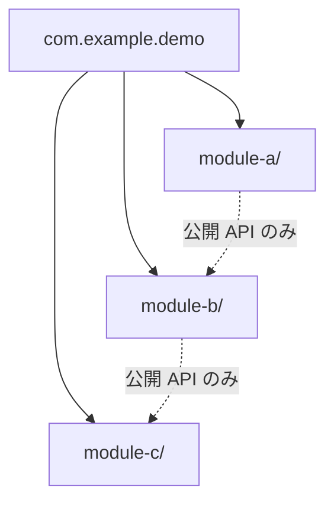

# Components

## Backend Components

### DemoApplication

- **Package**: `com.example.demo`
- **Role**: Spring Boot アプリケーションのエントリーポイント
- **Annotations**: `@SpringBootApplication`
- **Note**: JaCoCo カバレッジ計測から除外

### TestcontainersConfiguration

- **Package**: `com.example.demo` (test)
- **Role**: ローカル開発・テスト用のインフラコンテナ設定
- **Annotations**: `@TestConfiguration`
- **Beans**:
  - `postgresContainer()` — PostgreSQL コンテナ（`@ServiceConnection`）
  - `grafanaLgtmContainer()` — Grafana LGTM スタックコンテナ（`@ServiceConnection`）

### TestDemoApplication

- **Package**: `com.example.demo` (test)
- **Role**: Testcontainers 付きのローカル開発用起動クラス
- **Usage**: `TestcontainersConfiguration` を組み込んで `DemoApplication` を起動

### DemoApplicationTests

- **Package**: `com.example.demo` (test)
- **Role**: アプリケーションコンテキストの統合テスト
- **Tests**: `contextLoads()` — Spring コンテキストの正常ロードを検証

## Frontend Components

### main.ts

- **Role**: SPA のエントリーポイント
- **Responsibility**: HTML テンプレートのレンダリング、カウンターの初期化
- **Dependencies**: `counter.ts`, `style.css`, 静的アセット

### counter.ts

- **Role**: カウンター機能モジュール
- **Exports**: `setupCounter(element: HTMLButtonElement)` — クリックカウンターのセットアップ

## Component Relationships

## Module Expansion Points

Spring Modulith の設計により、`com.example.demo` パッケージ配下にサブパッケージを追加することで新しいモジュールを作成できる。各モジュールは独立したドメインを持ち、Spring Modulith がモジュール間の依存関係を検証する。

