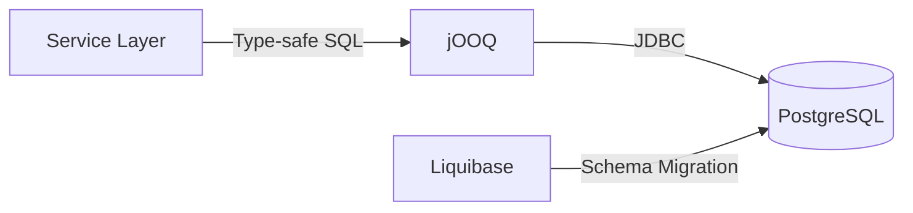

# Data Models

## Database

### Current State

データベーススキーマは未定義。Liquibase のマスターチェンジログは設定済みだが、マイグレーションファイルは未作成。

- **Master Changelog**: `backend/src/main/resources/db/changelog/db.changelog-master.yaml`
- **Migrations Directory**: `backend/src/main/resources/db/changelog/migrations/` (空)

### Database Access Pattern

jOOQ を使用した型安全な SQL クエリパターン。JPA/Hibernate ではなく jOOQ を選択しているため、エンティティクラスではなく jOOQ のコード生成による型安全なテーブル/レコードクラスを使用する設計。

## Null Safety Model

| Annotation       | Source   | Purpose                                |
| :--------------- | :------- | :------------------------------------- |
| `@NullMarked`    | JSpecify | パッケージレベルの non-null デフォルト  |
| `@Nullable`      | JSpecify | null 許容フィールド/パラメータの明示   |

- **Enforcement**: ErrorProne + NullAway (コンパイル時チェック)
- **Scope**: `com.example.demo` パッケージ全体
- **JSpecify Mode**: 有効 (`JSpecifyMode=true`)
- **Test Code**: NullAway は無効化

## Frontend Data Model

フロントエンドは現在、ローカルステートのみ（カウンター変数）。バックエンド API との連携は未実装。
