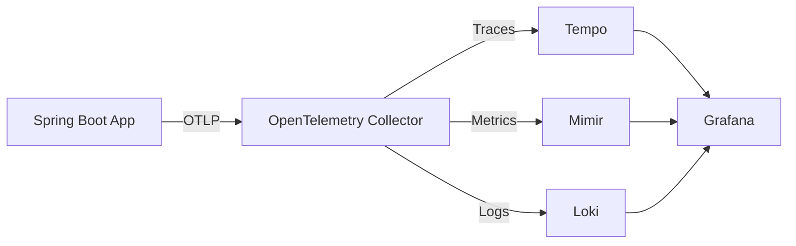

# Interfaces

## API Interfaces

### REST API (Spring WebMVC)

現時点ではカスタム REST エンドポイントは未実装。以下のフレームワーク提供エンドポイントが利用可能：

| Endpoint                | Source                | Description                    |
| :---------------------- | :-------------------- | :----------------------------- |
| `/actuator/**`          | Spring Boot Actuator  | ヘルスチェック、メトリクス等   |
| `/swagger-ui/**`        | SpringDoc OpenAPI     | API ドキュメント UI            |
| `/v3/api-docs/**`       | SpringDoc OpenAPI     | OpenAPI 3.0 仕様 (JSON/YAML)  |

### Security Interface

- **Type**: OAuth2 Resource Server
- **Authentication**: JWT Bearer Token
- **Framework**: Spring Security

## Database Interface

- **Technology**: jOOQ (型安全 SQL)
- **Database**: PostgreSQL
- **Migration**: Liquibase
- **Changelog**: `backend/src/main/resources/db/changelog/db.changelog-master.yaml`
- **Migrations Dir**: `backend/src/main/resources/db/changelog/migrations/`
- **Status**: マイグレーションファイル未作成（`.gitkeep` のみ）

## Observability Interface

- **Protocol**: OpenTelemetry (OTLP)
- **Backend**: Grafana LGTM Stack (Loki, Grafana, Tempo, Mimir)
- **Spring Integration**: `spring-boot-starter-opentelemetry` + `spring-modulith-observability`

## Module Interface (Spring Modulith)

Spring Modulith はモジュール間の依存関係を検証し、公開 API のみを通じたモジュール間通信を強制する。

- **Actuator**: `spring-modulith-actuator` でモジュール構造を公開
- **Testing**: `spring-modulith-starter-test` でモジュール構造テストを提供

## Frontend Interface

- **Dev Server**: `vp dev` (Vite dev server)
- **Build**: `tsc && vp build`
- **Preview**: `vp preview`
