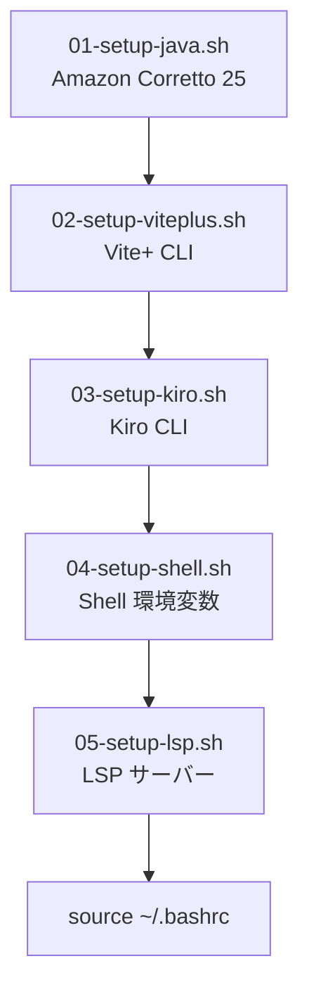
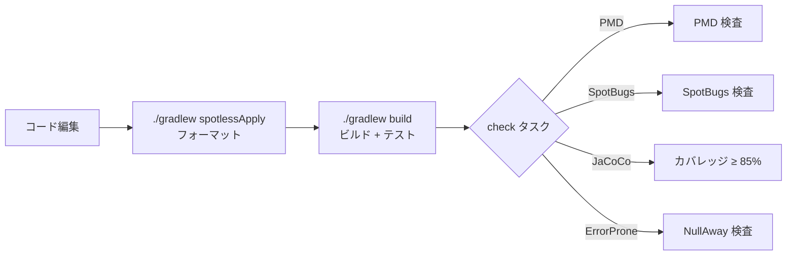
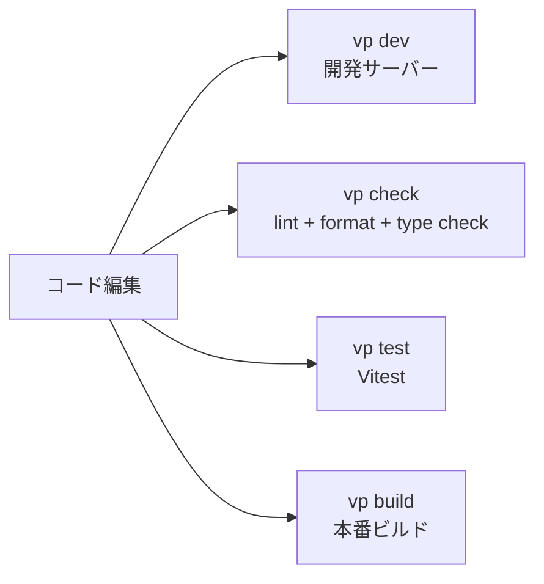
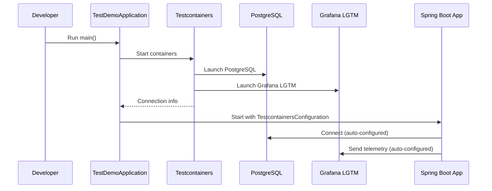
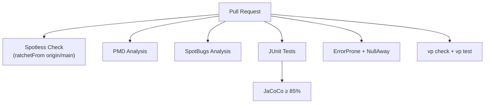

# Workflows

## Development Workflow

### Environment Setup

- **Platform**: WSL2 (Ubuntu 24.04) + Docker Desktop
- **IDE**: VSCode (Remote WSL)
- **Version Management**: `scripts/local-environment-setup/versions.env` で一元管理

### Backend Development

### Frontend Development

### Local Run with Testcontainers

`TestDemoApplication.main()` を実行すると、Testcontainers が自動的に PostgreSQL と Grafana LGTM コンテナを起動し、`@ServiceConnection` により接続情報が自動設定される。

## CI/CD Workflow

### Dependabot

- **Gradle**: `/backend` ディレクトリを週次スキャン
- **npm**: `/frontend` ディレクトリを週次スキャン

### Quality Gates

